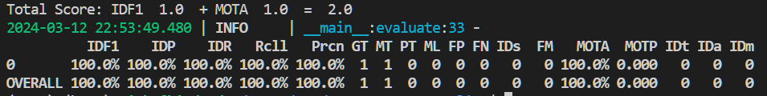
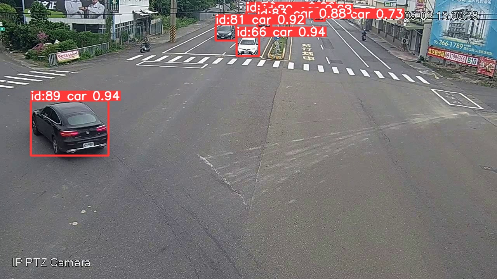
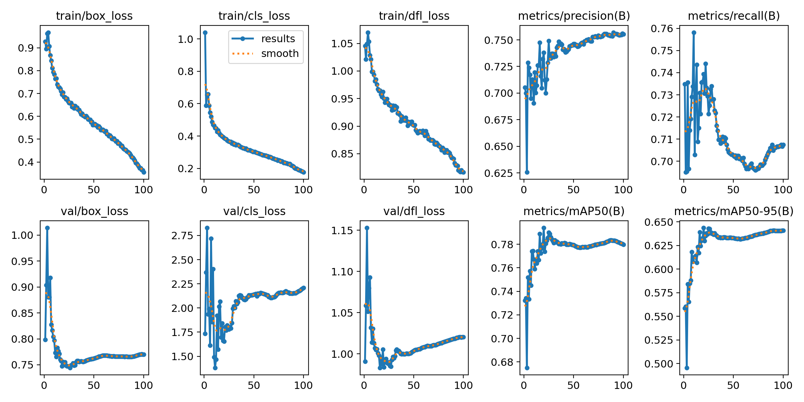

# AICup_MCMOT_Baseline

> [!WARNING]
> **This baseline only provides single-camera object tracking and does not include a ReID model for cross-camera association and tracking.**

- Our baseline is base on Ultralytics YOLOv8 framework, providing multiple object tracking (MOT) algorithms: BoT-SORT and Bytetrack. 
- In the BoT-SORT architecture, the ReID model used needs to be implemented and replaced independently. 
- For more details, you can refer to the following Repository: 
    - [Ultralytics YOLOv8](https://github.com/ultralytics/ultralytics)
    - [Offical BoT-SORT Implementation](https://github.com/NirAharon/BoT-SORT)

## Installation
**Step1.** Fork this Repository

**Step2.** Clone your Repository to your device

**Step3.** Create Conda environment and install `pytorch >= 2.0`
```bash
conda create -n AI_CUP python=3.9
conda activate AI_CUP
```

**Step4.** Install other requirement
```bash
cd AICup_MCMOT_Baseline
pip install -r requirements.txt
```

## Data Preparation
Download the AI_CUP dataset, original dataset structure is:
```python
├── train
│   ├── images
│   │   ├── 0902_150000_151900 (Timestamp: Date_StartTime_EndTime)
│   │   │  ├── 0_00001.jpg (CamID_FrameNum)
│   │   │  ├── 0_00002.jpg
│   │   │  ├── ...
│   │   │  ├── 1_00001.jpg (CamID_FrameNum)
│   │   │  ├── 1_00002.jpg
│   │   │  ├── ...
│   │   │  ├── 7_00001.jpg (CamID_FrameNum)
│   │   │  ├── 7_00002.jpg
│   │   ├── 0902_190000_191900 (Timestamp: Date_StartTime_EndTime)
│   │   │  ├── 0_00001.jpg (CamID_FrameNum)
│   │   │  ├── 0_00002.jpg
│   │   │  ├── ...
│   │   │  ├── 1_00001.jpg (CamID_FrameNum)
│   │   │  ├── 1_00002.jpg
│   │   │  ├── ...
│   │   │  ├── 7_00001.jpg (CamID_FrameNum)
│   │   │  ├── 7_00002.jpg
│   │   ├── ...
│   └── labels
│   │   ├── 0902_150000_151900 (Timestamp: Date_StartTime_EndTime)
│   │   │  ├── 0_00001.txt (CamID_FrameNum)
│   │   │  ├── 0_00002.txt
│   │   │  ├── ...
│   │   │  ├── 1_00001.txt (CamID_FrameNum)
│   │   │  ├── 1_00002.txt
│   │   │  ├── ...
│   │   │  ├── 7_00001.txt (CamID_FrameNum)
│   │   │  ├── 7_00002.txt
│   │   ├── 0902_190000_191900 (Timestamp: Date_StartTime_EndTime)
│   │   │  ├── 0_00001.txt (CamID_FrameNum)
│   │   │  ├── 0_00002.txt
│   │   │  ├── ...
│   │   │  ├── 1_00001.txt (CamID_FrameNum)
│   │   │  ├── 1_00002.txt
│   │   │  ├── ...
│   │   │  ├── 7_00001.txt (CamID_FrameNum)
│   │   │  ├── 7_00002.txt
│   │   ├── ...
--------------------------------------------------
├── test
│   ├── images
│   │   ├── 0902_150000_151900 (Timestamp: Date_StartTime_EndTime)
│   │   │  ├── 0_00001.jpg (CamID_FrameNum)
│   │   │  ├── 0_00002.jpg
│   │   │  ├── ...
│   │   │  ├── 1_00001.jpg (CamID_FrameNum)
│   │   │  ├── 1_00002.jpg
│   │   │  ├── ...
│   │   │  ├── 7_00001.jpg (CamID_FrameNum)
│   │   │  ├── 7_00002.jpg
│   │   ├── 0902_190000_191900 (Timestamp: Date_StartTime_EndTime)
│   │   │  ├── 0_00001.jpg (CamID_FrameNum)
│   │   │  ├── 0_00002.jpg
│   │   │  ├── ...
│   │   │  ├── 1_00001.jpg (CamID_FrameNum)
│   │   │  ├── 1_00002.jpg
│   │   │  ├── ...
│   │   │  ├── 7_00001.jpg (CamID_FrameNum)
│   │   │  ├── 7_00002.jpg
│   │   ├── ...
```

run the `AICUP_to_YOLOv8.py` by following commend:
```
cd AICup_MCMOT_Baseline
python utils/AICUP_to_YOLOv8.py --AICUP_dir "your AICUP dataset path" --YOLOv8_dir "converted dataset directory" --train_ratio "The ratio of the train set when splitting the train set and the validation set (default 0.8)"
```

The file tree after conversion by `AICUP_to_YOLOv8.py` is as follows:

```python
/datasets/AI_CUP_MCMOT_dataset/yolo
    ├── train
    │   ├── images
    │   │   ├── 0902_150000_151900_0_00001.jpg (Date_StartTime_EndTime_CamID_FrameNum)
    │   │   ├── 0902_150000_151900_0_00002.jpg
    │   │   ├── ...
    │   │   ├── 0902_150000_151900_7_00001.jpg
    │   │   ├── 0902_150000_151900_7_00002.jpg
    │   │   ├── ...
    │   └── labels
    │   │   ├── 0902_150000_151900_0_00001.txt (Date_StartTime_EndTime_CamID_FrameNum)
    │   │   ├── 0902_150000_151900_0_00002.txt
    │   │   ├── ...
    │   │   ├── 0902_150000_151900_7_00001.txt
    │   │   ├── 0902_150000_151900_7_00002.txt
    │   │   ├── ...
    ├── valid
    │   ├── images
    │   │   ├── 1015_190000_191900_0_00001.jpg (Date_StartTime_EndTime_CamID_FrameNum)
    │   │   ├── 1015_190000_191900_0_00002.jpg
    │   │   ├── ...
    │   │   ├── 1015_190000_191900_7_00001.jpg
    │   │   ├── 1015_190000_191900_7_00002.jpg
    │   │   ├── ...
    │   └── labels
    │   │   ├── 1015_190000_191900_0_00001.txt (Date_StartTime_EndTime_CamID_FrameNum)
    │   │   ├── 1015_190000_191900_0_00002.txt
    │   │   ├── ...
    │   │   ├── 1015_190000_191900_7_00001.txt
    │   │   ├── 1015_190000_191900_7_00002.txt
    │   │   ├── ...
    ├── MCMOT.yaml (Yolo config)
```

## Ground Truth Format
Each image corresponds to a text file, an example is provided below:

> [!WARNING]
> **The coordinates and dimensions of the Ground Truth data are normalized**

class|center_x|center_y|width   |height|track_ID|
-----|--------|--------|--------|------|--------|
0    |0.704687|0.367592|0.032291|0.1   |1       |

```python
# image_name1.txt

0 0.704687 0.367592 0.032291 0.1 1
0 0.704166 0.403703 0.030208 0.087037 2
0 0.929166 0.710185 0.051041 0.162962 3
0 0.934114 0.750925 0.084895 0.162962 4
0 0.780208 0.273148 0.023958 0.062962 5
0 0.780989 0.246296 0.022395 0.066666 6
```

The Ground Truth after conversion by `AICUP_to_YOLOv8.py` is as follows:

> [!WARNING]
> **The coordinates and dimensions of the Ground Truth data are normalized**

class|center_x|center_y|width   |height|
-----|--------|--------|--------|------|
0    |0.704687|0.367592|0.032291|0.1   |

```python
# image_name1.txt

0 0.704687 0.367592 0.032291 0.1
0 0.704166 0.403703 0.030208 0.087037
0 0.929166 0.710185 0.051041 0.162962
0 0.934114 0.750925 0.084895 0.162962
0 0.780208 0.273148 0.023958 0.062962
0 0.780989 0.246296 0.022395 0.066666
```

## Training Yolov8
You can see the how to used the training, valid, and predict function at 
- [YOLOv8 training docs](https://docs.ultralytics.com/zh/modes/train/#train-settings)
- [YOLOv8 valid docs](https://docs.ultralytics.com/zh/modes/val/)
- [YOLOv8 predict docs](https://docs.ultralytics.com/zh/modes/predict/)

```bash
cd AICup_MCMOT_Baseline
python train_YOLO/train_YOLOv8.py
python train_YOLO/val_YOLOv8.py
```

The Result will be save at `runs/detect` folder

## Tracking and create the submit file

You Can run our sample code: `detect.py` by following commend:
```bash
cd AICup_MCMOT_Baseline
python detect.py --data_path "your dataset path" --yolo_path "your model weight path" --devices "0, 1"
```

#### Config:
- `data_path`: Your dataset folder

- `yolo_path`: Your YOLO model's weight

- `out_file_path`: Where your output file save

- `devices`: 'cpu' or 'gpu number', support multi-GPU training

- `video_shape`: original video resolution

- `imgsz`: yolo input size

- `save_res`: bool, save submit file, default = True

The submission result default save at `runs/tracking_res`

## Where to add ReID model in Tracking algorithm
if you want to add ReID model in YOLOv8's tracking, you need to edit YOLOv8 source code at:
[ultralytics/ultralytics/trackers/bot_sort.py](https://github.com/ultralytics/ultralytics/blob/af6c02c39be4ee30e0119cc24468912257a3b529/ultralytics/trackers/bot_sort.py#L160)

For example, In the conda environment, the source code is locate at:
```bash
.conda/envs/(your_env_name)/lib/python3.9/site-packages/ultralytics/trackers/bot_sort.py
```

## Evulate Format
Using same format on [py-motmetrics](https://github.com/cheind/py-motmetrics)

> [!WARNING]
> **The evulate images resolution is `1280 * 720`**

frame_id| track_id | bb_left|  bb_top | bb_width |bb_height|3d_x|3d_y|3d_z|
--------| -------- | -------| --------| ---------|-------- |----|----|----|
1       |1         |843     |742      | 30       |30       |-1  |-1  |-1  |

## How to Evulate your submission
Before evaluate, you need to run `utils/AICUP_to_MOT15.py` to convert ground truth into submission format:

```bash
cd AICup_MCMOT_Baseline
python utils/AICUP_to_MOT15.py --AICUP_dir "your AICUP dataset path" --MOT15_dir "converted dataset directory" --imgsz "img size, (height, width)"
```

You can used `utils/evaluate.py` to Evulate your submission by following commend:

```bash
cd AICup_MCMOT_Baseline
python utils/evaluate.py --gt_dir "Path to the ground truth directory" --ts_dir "Path to the tracking result directory"
```

The gt_dir and ts_dir file tree is as follows:

```python
├── gt_dir
│   ├── 0902_150000_151900.txt
│   ├── 0902_190000_191900.txt
│   ├── ...
├── ts_dir
│   ├── 0902_150000_151900.txt
│   ├── 0902_190000_191900.txt
│   ├── ...
```

Than you can get the result:


## Result



## ToDo

- [x] Fix `detect.py` output
- [x] Implement `AICUP_to_MOT15.py`
- [ ] Upload baseline score
- [ ] Release test set